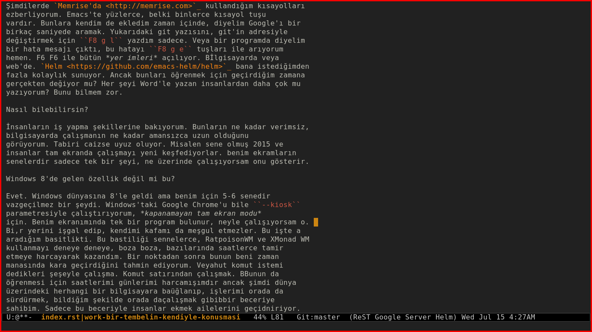

Verimlilik Aşığı Bir Tembelin Özmuhaveresi
==========================================

:date: 2015-07-17 04:13:09 +0300

.. :author: Emin Reşah
.. :date: Mon Jul 13 13:04:38 EEST 2015 
.. :dp: 13146 

Hayatını basitleştirmeye çalışırken daha da karmaşık hale getiriyorsun
diyor kafam. *Bunu neden yapıyorsun?* Kendine sağlam ve asla bozulmayan bir çalışma
sistemi uydurmak? Belki kendinden beklediğin bu mükemmel verimliliğin asıl
sebebi, tam da verimliliğin tersidir. Eğlence için kendine bir
*verimlilik* masalı seçmişsindir, belki?

İşle ilgilenmek yerine, *işle ilgilenmeyi kolaylaştırmak* üzerine
kurulu bir hayat. Böyle bir hayatın insanı nasıl yorduğunun şahidiyim.
*Nasıl yoruyor?* Daima *bunu nasıl bırakırım* veya *daha kolay nasıl
yaparım* diye düşünüyorsun. Yoran bu düşünce. *Bunu nasıl daha
kolaylaştırırım, daha verimli yaparım, daha kısa zamanda bitiririm?*
*Yap geç işte* diyen biri lazım kafamın ardında. *O kadar düşünme,
düşündükçe zorlaşıyor.* Nasıl kolaylaştıracağını düşünmek
insanın hayatını daha da zorlaştırıyor.

*Ancak* diyor, kafamın içindeki başka bir ses, *bu kolaylaştırma işini
aslında beceriyorsun.* İnsanların aylarca uğraşacağı işleri günlerle,
saatlerce uğraşacaklarını dakikalarla yapabiliyorsun. Bu sayede diğer
işlere zaman kalıyor. Belli konularda hızlanarak diğerlerine *zaman* elde ediyorsun.

*Peki gerçekten ödüyor mu bunu?* 

Gerçekten ödeyip ödemediğini nasıl bilebilirim? Diyelim Emacs
öğrenmenin ödeyip ödemediğini? Diyelim klavye makrolarını öğrenmenin
beni zamanca kara geçirip geçirmediğini?  Sair araçları
deniyorum. Hayatımı bir yandan basit tutmaya ama kullandığım araçları
iyi tanımaya çalışıyorum. Bulduğum her saçmalığa atlamayı bıraktım ama
güçlü araçları iyi kullanmanın faziletlerini gördüm. Öğrendiğimde ne
kadar etkili olduğunu. Uzun zamandır, belki yıllardır yazı
kaybetmedim. Web'e koyduklarımı kaybedebiliyorum ama en az dört
ayrı bilgisayarda, `git <https://git-scm.com/>`_ vasıtasıyla duranları
kaybetmiyorum. Kurduğum düzenekler çalışıyor aslında, ancak bazıları o
kadar iyi çalışıyor ki, hayatımdan o sorun çıkıp
gidiyor. Bilgisayarına virüs girmenin, yazılarının kaybolmasının,
değişiklikleri takip edememenin ne demek olduğunu unuttuğun için sanki
hiçbir işe yaramıyormuş gibi hissediyorsun. 

O zaman kendini bir boşlukta buluyorsun.

Evet. Mesela geçenlerde `Yasemin'in blogunun <http://pass.coffee>`_
adresini değiştirmek gerekti. Bunu on sene önceki ben *çok zor*
yapardı. Bir kaç saat sürerdi. *Çok zor* dediğim o. O birkaç saatten
yırtmak için aylarca sürünürdü muhtemelen. Şimdikinde birkaç dakika
sürdü. Bir iki komut yazıp, tüm veritabanındaki eski URL kayıtlarını,
yenisine çevirdim. Ama o komutları öğrenmem belki birkaç saatten fazla
almıştır. Evet.

Şimdilerde `Memrise'da <http://memrise.com>`_ kullandığım kısayolları
ezberliyorum. Emacs'te yüzlerce, belki binlerce kısayol tuşu
vardır. Bunlara kendim de ekledim zaman içinde, diyelim Google'ı bir
birkaç saniyede aramak. Yukarıdaki git yazısını, git'in adresiyle
değiştirmek için ``F8 g l`` tuşlarına dokundum sadece. Veya bir programda diyelim
bir hata mesajı çıktı, bu hatayı ``F8 g e`` tuşları ile arıyorum
hemen. F6 F6 ile bütün *yer imleri* açılıyor. Bilgisayarda veya
web'de. `Helm <https://github.com/emacs-helm/helm>`_ istediğimden
fazla kolaylık sunuyor. Ancak bunları öğrenmek için geçirdiğim zamana
gerçekten değiyor mu? Her şeyi Word'le yazan insanlardan daha çok mu
yazıyorum? Bunu bilmem zor.

Nasıl bilebilirsin?

İnsanların iş yapma şekillerine bakıyorum. Bunların ne kadar verimsiz,
bilgisayarda çalışmanın ne kadar amansızca uzun olduğunu
görüyorum. Tabiri caizse uyuz oluyor. Misalen sene olmuş 2015 ve
insanlar tam ekranda çalışmayı yeni keşfediyorlar. benim ekramların
senelerdir sadece tek bir şeyi, ne üzerinde çalışıyorsam onu gösterir.

Windows 8'de gelen özellik değil mi bu?

Evet. Windows dünyasına 8'le geldi ama benim için 5-6 senedir
vazgeçilmez bir şeydi. Windows'taki Google Chrome'u bile ``--kiosk``
parametresiyle çalıştırıyorum, *kapanamayan tam ekran modu*
için. 

Şu anki ekran görüntüm mesela, aşağıda.

Bu *verimliliği* senelerce, `Ratpoison
<http://www.nongnu.org/ratpoison/>`_ ve `XMonad <http://xmonad.org/>`_
kullanmayı deneye deneye, boza boza, bazılarında saatlerce tamir
etmeye harcayarak kazandım. Bir noktadan sonra kazandığım saniyelerin kaybettiğim saatleri ödediğini ve
kara geçirdiğini tahmin ediyorum. Veyahut komut satırı dedikleri
*şeyle* çalışma. Bunu öğrenmek için günlerimi harcamışımdır
ancak şimdi dünya üzerindeki herhangi bir bilgisayara bağlanıp,
işlerimi orada sürdürmek, bildiğim şekilde orada çalışmak becerisine
sahibim. Sadece bu beceriyle ekmek parası kazanıyor insanlar.

Ancak bunların hepsinden kar sağlamıyorsun.

Evet. Sağlamıyorum. Bazı yatırımlarım ölü yatırım oluyor. `Vim'e
<http://www.vim.org/>`_ biraz zaman yatırdım geçenlerde, belki birkaç
saat kısa yol tuşlarını öğrendim.  Eskiden beri sevmezdim, yine
sevmedim. Allah muhtaç etmesin. Veya dil öğrenmeye ayırdığım zaman,
Latince'ye ayırdığım zaman, diyelim, hiçbir faydası oldu mu bu vakte
kadar? Bugünlerde `Çince öğrenmeye
<http://www.memrise.com/course/541/hsk-level-1-introductory-mandarin-with-audio/>`_
ve `Osmanlıca kelime bilgimi ilerletmeye
<http://www.memrise.com/course/729518/osmanl-turkcesi-mana/>`_
çalışıyorum. Bunların bir faydası olacak mı?  Almanca bilgimin bir işe
yaradığı oldu mu? Bugüne kadar Almancamdan daha iyi İngilizce bilmeyen
bir Almanla karşılaşmadım. Kimseyle Almanca konuşmak için bir şart
ortaya çıkmadı. Mecbur kalmadım. Bundan sonra da muhtemelen
kalmam. Acaba ona yatırdığım ve `Duolingo <https://duolingo.com/>`_ ve
Memrise'da hala yatırmaya devam ettiğim saatlerin geri dönüşü olacak
mı? Bunların asıl anlamı, yoksa, kendime iş dışında meşgale bulmam,
eğlence bulmam mı? Eğlence olduğunu itiraf edemediğim eğlenceler?

Bence bu ikincisi. Onun için kendini bunları yaparken rahat
hissetmiyorsun. 

İşim nedir diye soruyorum o zaman. Sorguladığım işimi nasıl
yaptığımda ziyade, neden kendime bazı faaliyetleri *iş,* bazı
faaliyetleri *iş dışı* gördüğüm oluyor. Para kazanmaksa, bunun birden
fazla yolu var ve eminim şimdikinden daha kolay ve az baş ağrıtan
yolları da vardır. Daha manasız ve verimsiz olsa da, daha rahat para
kazandıran. 

Belki de işin tek anlamı diğer insanların hayatıyla ilgilidir? Onlara
bir faydan varsa, iştir. Yoksa eğlence?

O halde dünyanın çok büyük bir kısmı işsiz. Hepimiz *saat
dolduruyoruz.*
